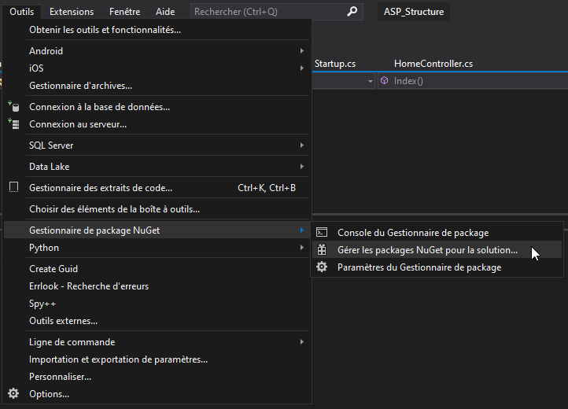
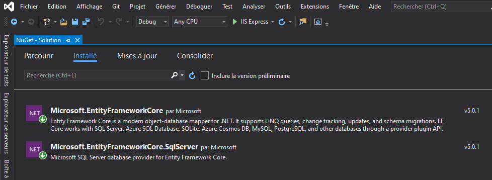

# Ajout Entity Framework à un projet ASP.NET Core 5.0

Ce document décrit la procédure d'installation de Entity Framework dans un projet Visual Studio.

Entity Framework est un ORM (Object Relational Mapping).

Un ORM permet de lier une base de données à une couche Métier et d'interragir avec la base de données en utilisant la syntaxe Objet (pas de SQL nécessaire).

## Installer le package Entity Framework

Sous Visual Studio, vous pouvez installer des packages pour vos projets.
Les packages sont plus ou moins l'équivalent des modules NodeJS.

Le package Entity Framework est disponible dans le gestionnaire de package de Visual Studio : NuGet.

#### Procédure d'installation d'un package :

https://docs.microsoft.com/fr-fr/nuget/quickstart/install-and-use-a-package-in-visual-studio

Pour vos projets et exercices ASP.NET, vous devez installer les packages suivants : 

## Configuration et Modèles

Le lien suivant vous décrit le fonctionnement des Annotations :

https://www.learnentityframeworkcore.com/configuration

Suite à venir...