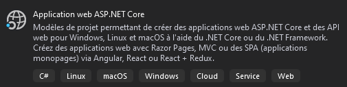
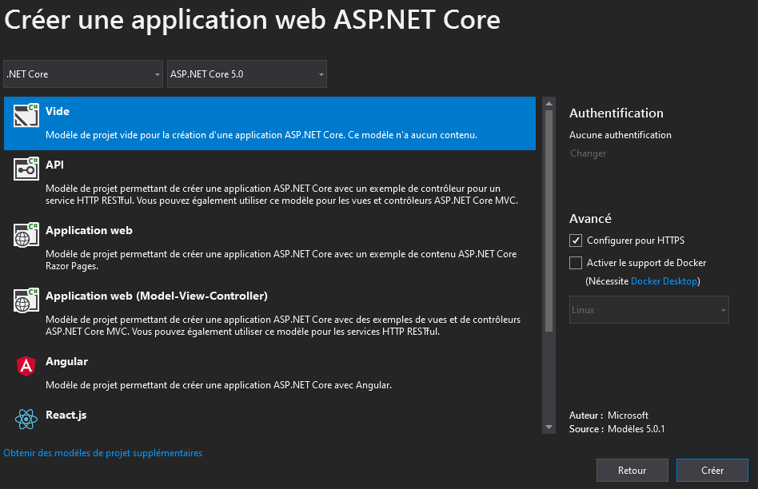
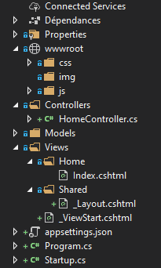

# Procédure de création d'un site ASP.NET Core 5.0

Ce document décrit la procédure de création d'un site web ASP.NET **à partir d'un modèle vide**.

Le dossier "ASP_Structure" contient des exemples de projets ASP.NET Core 5.0.

L'exemple "ASP_Structure/ASP_Intro" contient le code commenté de la procédure décrite dans ce document.


## Création du projet

Ouvrir Visual Studio.

Créez un nouveau projet "Application web ASP.NET Core" :



Cliquez sur "Suivant".

Choisissez un nom et un emplacement pour votre projet.

Cliquez sur "Suivant".

Choisissez le modèle "vide", activez le support HTTPS puis cliquez sur "Créer" :




## Configuration du projet

Ouvrez le fichier "Startup.cs".


Dans la méthode "**ConfigureServices**" ajouter le code suivant :

```csharp
services.AddControllersWithViews();
```

pour activer la gestion des contrôleurs et des vues.


Dans la méthode "**Configure**", supprimez le code suivant : 

```csharp
app.UseEndpoints(endpoints =>
{
	endpoints.MapGet("/", async context =>
    {
		await context.Response.WriteAsync("Hello World!");
	});
});
```

et remplacez le par le code suivant : 

```csharp
app.UseDefaultFiles();
app.UseStaticFiles(); 

app.UseEndpoints(endpoints =>
            {
                endpoints.MapControllerRoute(
                    name: "default",
                    pattern: "{controller=Home}/{action=Index}/{id?}"
                );
            });
```

**UseDefaultFiles** active la gestion des extensions web standards

**UseStaticFiles** active la gestion des fichiers statiques (css, js, images...) stockés dans le répertoire "**wwwroot**".

**MapControllerRoute** ajoute une route nommée "**name**" dont l'url correspond au format "**pattern**".

**controller**: nom du contrôleur à invoquer.
**action**: nom de la méthode à exécuter dans le contrôleur invoqué.
**id**: valeur injectée dans la méthode exécutée (la méthode doit alors posséder un argument nommé "id").


## Création des répertoires par défaut :

A la racine du projet, créez les dossiers suivants :

**wwwroot**: contient les fichiers statiques du site (css, js, images...)

**Controllers**: contient les contrôleurs

**Models**: contient les modèles

**Views** : contient les vues HTML

Dans le dossier **wwwroot**, créez les sous-dossiers **css**, **js** et **img**.

Dans le dossier **Controllers**, ajoutez un nouveau Contrôleur vide "**HomeController.cs**".

Dans le dossier **Views**, créez les sous-dossiers **Home** et **Shared**.

Toujours dans le dossier **Views**, ajoutez un nouvel élément "début de la vue Razor",  "**_ViewStart.cshtml**"

Dans le sous-dossier **Views/Shared**, créez un nouvel élément "disposition Razor", "**_Layout.cshtml**".

Dans le sous-dossier **Views/Home**, créez une nouvelle vue, "**Index.cshtml**".


La structure de votre projet ressemble alors à ceci :




>  Votre projet contient désormais la structure par défaut d'un projet ASP.NET Core.


Vous connaissez maintenant les composants et fichiers par défaut nécessaires au bon fonctionnement d'une application web ASP.NET Core standard.


Vous pouvez également créer des projets ASP.NET à partir de modèles prédéfinis.

Pour créer un projet à partir d'un modèle MVC classique, vous pouvez consulter le tuto suivant : 

https://docs.microsoft.com/fr-fr/aspnet/core/tutorials/first-mvc-app/start-mvc?view=aspnetcore-5.0&tabs=visual-studio