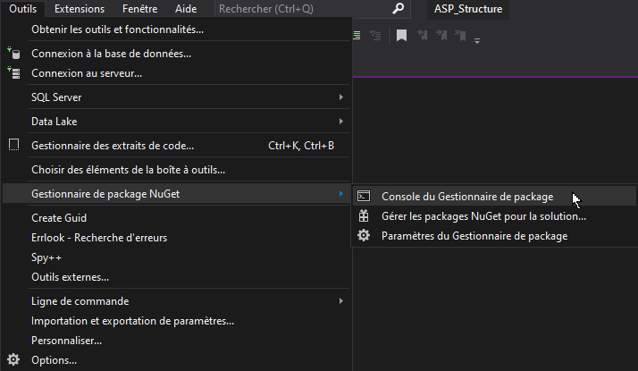

Démarrer à partir d'une base de données existante.

Dans cette approche, vous procédez à l'ingénierie inverse d'un modèle à partir d'une base de données existante, ce qui entraîne la génération d'une couche d'accès aux données adaptée et directement utilisable.

Ce document montre comment utiliser une base de données existante pour générer un modèle à partir d'une base de données SQL Server dans une application ASP.NET à l'aide de l'interface de ligne de commande NuGet Package Manager avec Microsoft Visual Studio.


## Autres ressources

- [Tutorial sur entityframeworktutorial.net](https://www.entityframeworktutorial.net/efcore/create-model-for-existing-database-in-ef-core.aspx)


## Créer la base de données 

La base de données `DbBooks` qui sera utilisée dans ce document est présentée ci-dessous. 
Elle contient 4 tables avec un exemple pour une relation OneToMany et une relation ManyToMany.

```sql
CREATE TABLE authors 
(
    author_id INT PRIMARY KEY IDENTITY(1,1),
    author_name VARCHAR(50) UNIQUE NOT NULL
);

CREATE TABLE books 
(
    book_id INT PRIMARY KEY IDENTITY(1,1),
    book_title VARCHAR(100) NOT NULL,
    book_date DATETIME NULL,
    book_author INT NOT NULL,
    CONSTRAINT FkBooksAuthors FOREIGN KEY (book_author) REFERENCES authors(author_id);
);

CREATE TABLE users 
(
    user_id INT PRIMARY KEY IDENTITY(1,1),
    user_name VARCHAR(50) UNIQUE NOT NULL
);

CREATE TABLE readings 
(
    read_user INT NOT NULL,
    read_book INT NOT NULL,
    PRIMARY KEY(read_user, read_book),
    CONSTRAINT FkReadingsUsers FOREIGN KEY (read_user) REFERENCES users(user_id),
    CONSTRAINT FkReadingsBooks FOREIGN KEY (read_book) REFERENCES books(book_id);
);

```

Cette base de données sera installée sur un serveur SQLServer local sous le nom "DbBooks".

La chaîne de connexion suivante sera utilisée pour accéder à la base de données :

```
Server=(localdb)\mssqllocaldb;Database=DbBooks;Trusted_Connection=True;MultipleActiveResultSets=true
```

## Créer le projet

Ouvrir Visual Studio Community et créez un nouveau projet web "ASP.NET Core 5.x" avec Entity Framework Core.

- [Créer un projet ASP.NET avec Entity Framework](creer-projet-asp.md)

Avant de passer à la suite, assurez-vous des points suivants :

- la base de données est installée
- la chaine de connexion est correcte
- le répertoire "Models" existe dans le projet


## Console Nuget 

La console du gestionnaire de package NuGet est utilisée pour l'opération d'ingénieurie inverse.

- Définir le projet en tant que "Projet de démarrage"
- Ouvrir la console Nuget : 




### Créer les classes Modèles 

- Exécuter la commande suivante :

> PM> Scaffold-DbContext Name="DbBooks" Microsoft.EntityFrameworkCore.SqlServer -OutputDir Models

Ceci génère les modèles et le contexte de base de données. consultez le contenu du dossier "Models"...

Scaffold-DbContext = Commande pour lancer l'opération d'ingénieurie inverse
- "Name="DbBooks"" = "Nom du ConnectionString dans le fichier appsettings.json"
- "Microsoft.EntityFrameworkCore.SqlServer" = Pilote (Driver) à utiliser (à adapter au SGBD cible)
- "-OutputDir Models" = générer les classes dans le répertoire "Models" du projet.

### Mettre à jour les classes Modèles 

- Exécuter la commande suivante (même commande avec un argument "-f" supplémentaire) :

> PM> Scaffold-DbContext Name="DbBooks" Microsoft.EntityFrameworkCore.SqlServer -OutputDir Models -f


## Configuration par défaut

Par défaut, Entity Framework utilise [Fluent API](https://www.learnentityframeworkcore.com/configuration/fluent-api) pour configurer le contexte de base de données.

### Utiliser les annotations

Si vous préférez qu'Entity Framework utilise les Annotations dans les modèles, ajoutez l'argument "-DataAnnotations" à la fin de la commande : 

> PM> Scaffold-DbContext Name="DbBooks" Microsoft.EntityFrameworkCore.SqlServer -OutputDir Models -DataAnnotations

- [Plus d'informations sur les annotations](https://www.learnentityframeworkcore.com/configuration/data-annotation-attributes)

### Définir le nom de la classe DbContext

Par défaut, le nom de la classe de contexte de base de données (DbContext) correspond au nom de la base de donnée utilisée suivi de "Context".
Si vous souhaitez définir le nom de la classe du contexte de base de données, ajouter l'argument "-Context" suivi du nom désiré : 

> PM> Scaffold-DbContext Name="DbBooks" Microsoft.EntityFrameworkCore.SqlServer -OutputDir Models -Context "MyDatabaseContext" 


### Combiner les arguments

Vous pouvez bien entendu combiner tous ces arguments : 

> PM> Scaffold-DbContext Name="DbBooks" Microsoft.EntityFrameworkCore.SqlServer -OutputDir Models -Context "MyDatabaseContext" -DataAnnotations -f
