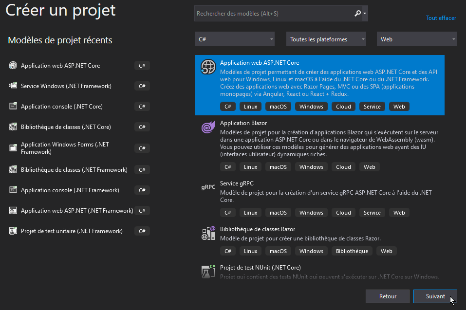
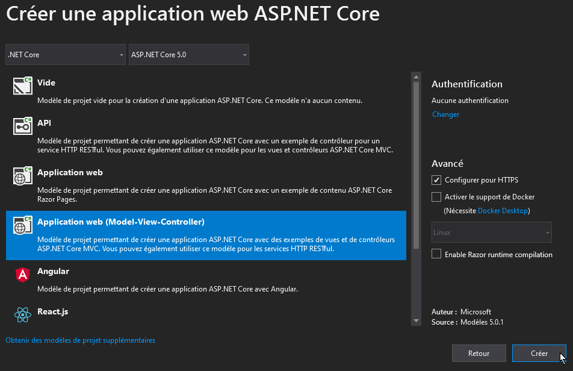

Créer un nouveau projet web MVC avec ASP.NET 5.x.

Ce document présente la procédure pour créer un nouveau projet ASP.NET MVC à partir d'un modèle MVC.

## Créer un projet web ASP.NET

- Ouvrir Visual Studio Community
- Créer un nouveau projet/solution
- Sélectionner le modèle "Application web ASP.NET Core"

- Sur l'écran suivant, nommer le projet/solution puis cliquer sur "Créer".

- Sur l'écran suivant, sélectionner le modèle MVC, puis cliquer sur "Créer"

Votre projet est désormais prêt et pré-configuré, vous pouvez maintenant [installer Entity Framework](creer-projet-asp.md).

