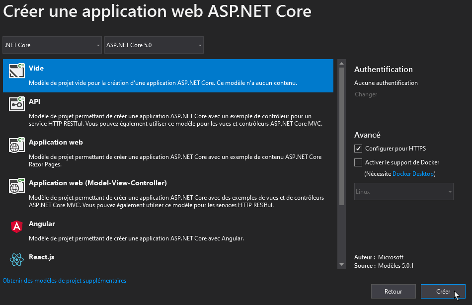

Créer un nouveau projet web MVC avec ASP.NET 5.x.

Ce document présente la procédure pour créer un nouveau projet ASP.NET MVC à partir d'un modèle vide.

## Créer un projet web ASP.NET

- Ouvrir Visual Studio Community
- Créer un nouveau projet/solution
- Sélectionner le modèle "Application web ASP.NET Core"


- Sur l'écran suivant, nommer le projet/solution puis cliquer sur "Créer".

- Sur l'écran suivant, sélectionner le modèle vide




## Créer les dossiers et fichiers de base

A la racine du projet, créez les dossiers suivants :

- **wwwroot**: contient les fichiers statiques du site (css, js, images...)
    - Dans le dossier **wwwroot**, créez les sous-dossiers **css**, **js** et **img**.

- **Controllers**: contient les contrôleurs
    - Dans le dossier **Controllers**, ajoutez un nouveau Contrôleur vide "**HomeController.cs**".

- **Models**: contient les modèles

- **Views** : contient les vues HTML
    - Dans le dossier **Views**, créez les sous-dossiers "**Home**" et "**Shared**"
    - Toujours dans le dossier **Views**, ajoutez un nouvel élément "début de la vue Razor",  "**_ViewStart.cshtml**"
    - Toujours dans le dossier **Views**, ajoutez un nouvel élément "Importations de la vue Razor",  "**_ViewImports.cshtml**"
    - Dans le sous-dossier **Views/Shared**, créez un nouvel élément "disposition Razor", "**_Layout.cshtml**"
    - Dans le sous-dossier **Views/Home**, créez une nouvelle vue, "**Index.cshtml**"


Votre projet contient désormais la structure de base d'un projet MVC.


## Configuration du projet

Ouvrez le fichier "Startup.cs".


Pour activer la gestion des contrôleurs et des vues, ajouter le code suivant dans la méthode "**ConfigureServices**" :

```csharp
services.AddControllersWithViews();
```

Dans la méthode "**Configure**", supprimez le code suivant : 

```csharp
app.UseEndpoints(endpoints =>
{
	endpoints.MapGet("/", async context =>
    {
		await context.Response.WriteAsync("Hello World!");
	});
});
```

et remplacez le par le code suivant : 

```csharp
app.UseDefaultFiles();
app.UseStaticFiles(); 

app.UseEndpoints(endpoints =>
{
    endpoints.MapControllerRoute(
        name: "default",
        pattern: "{controller=Home}/{action=Index}/{id?}"
    );
    });
```

**UseDefaultFiles** active la gestion des extensions web standards

**UseStaticFiles** active la gestion des fichiers statiques (css, js, images...) stockés dans le répertoire "**wwwroot**".

**MapControllerRoute** ajoute une route nommée "**name**" dont l'url correspond au format "**pattern**".

**controller**: nom du contrôleur à invoquer.
**action**: nom de la méthode à exécuter dans le contrôleur invoqué.
**id**: valeur injectée dans la méthode exécutée (la méthode doit alors posséder un argument nommé "id").


Ouvrir le fichier "Views/_ViewImports.cshtml"

Ajouter la ligne suivante pour importer l'espace de noms des Helpers HTML Razor (pour gérer les balises spécifiques au moteur de vue Razor)

```
@addTagHelper *, Microsoft.AspNetCore.Mvc.TagHelpers
```

Votre projet est désormais prêts, vous pouvez maintenant [installer Entity Framework](creer-projet-asp.md).

