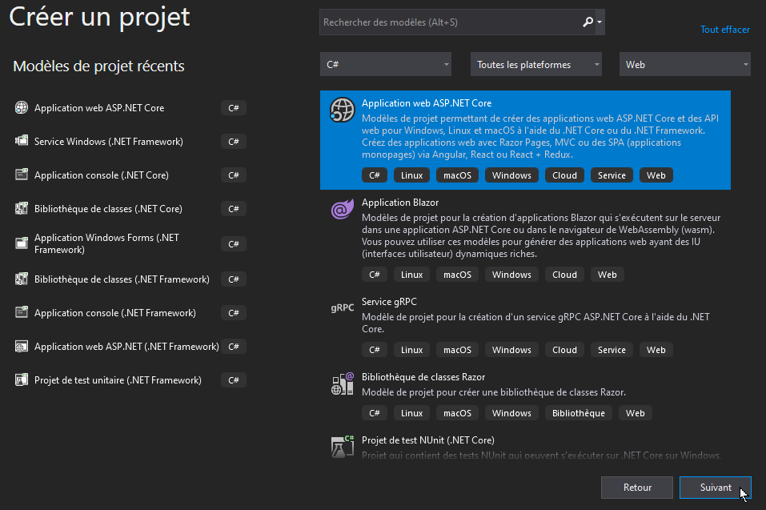

Créer un nouveau projet web MVC avec ASP.NET 5.x.

Ce document présente la procédure pour créer un nouveau projet ASP.NET MVC et y installer l'ORM EntityFramework.

## Créer un projet web ASP.NET

- Ouvrir Visual Studio Community
- Créer un nouveau projet/solution
- Sélectionner le modèle "Application web ASP.NET Core"

- Sur l'écran suivant, nommer le projet/solution puis cliquer sur "Créer".

- Sur l'écran suivant, vous pouvez sélectionner le modèle vide ou le modèle MVC.
    - [Créer un projet ASP.NET à partir d'un modèle vide](creer-projet-asp-vide.md)
    - [Créer un projet ASP.NET à partir d'un modèle MVC](creer-projet-asp-mvc.md)

## Ajouter Entity Framework Core

- Lorsque le projet est créé, ouvrir le gestionnaire de package NuGet
    - Explorateur de solution --> clic droit sur le nom du projet
    - Cliquer sur "Gérer les packages NuGet"

Installer les packages suivants : 
- Microsoft.EntityFrameworkCore.Design
- Microsoft.EntityFrameworkCore.Tools
- Microsoft.EntityFrameworkCore.SqlServer
- Microsoft.EntityFrameworkCore.SqlServer.Design

## Ajouter la chaine de connexion

- Ouvrir le fichier `appsettings.json` à la racine de votre projet 
- Ajouter une entrée "ConnectionStrings" qui contiendra la ou les chaines de connexion pour accès à une ou plusieurs bases de données.

Exemple : 

- Server = Nom d'hôte du serveur de bases de données (ou nom de l'instance SQLServer si sur la même machine)
    - (localdb)\mssqllocaldb = instance SqlServer locale installée avec Visual Studio.
- Database = Nom de la base de données sur le serveur
- Trusted_Connections = connexion sécurisée requise
- MultipleActiveResultSets (MARS) = permettre l'exécution de "lots d'instructions SQL"

## Développer la couche d'accès aux données

Une fois votre projet créé et Entity Framework installé, vous pouvez passer au développement de la couche d'accès aux données.

- [Entity Framework : Approche "Code First"](https://www.entityframeworktutorial.net/efcore/entity-framework-core-console-application.aspx)
- [Entity Framework : Approche "Database First"](asp-database-first.md)