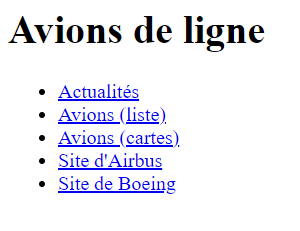
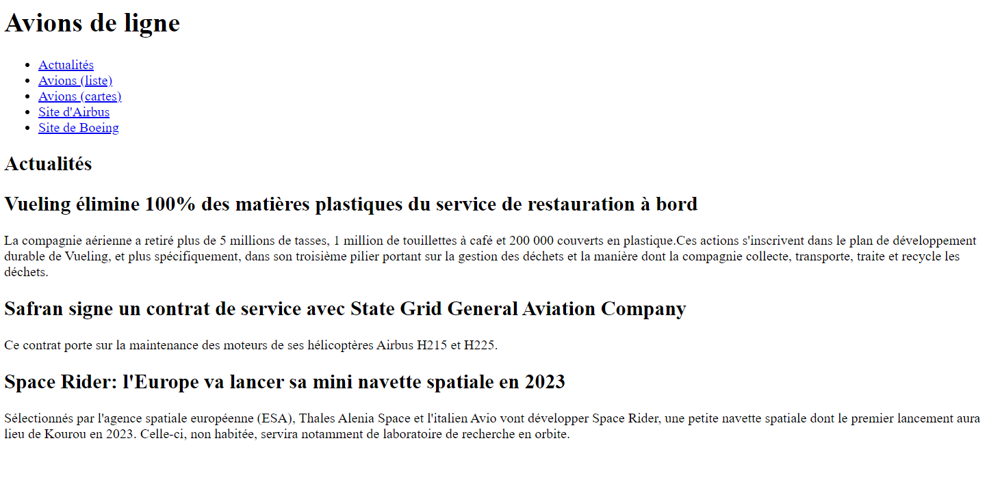
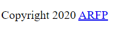

# Apprentissage des technologies "frontend"

Dans cette suite d'exercices, vous allez développer une page web statique qui affichera le contenu suivant :
- des actualités sur l'aéronautique
- une liste d'avions 
    - sous forme de tableau
    - sous forme de cartes
- un formulaire pour ajouter un avion au tableau

Avant de démarrer, vous pouvez consulter le tutoriel de base disponible sur MDN : 
https://developer.mozilla.org/en-US/docs/Learn/HTML 

## Structure d'un document HTML

Vous allez devoir mettre en place la structure standard d'une page HTML. 
Le respect de cette structure est indispensable pour que vos documents HTML soient correctement interprétés par les navigateurs et moteurs de recherches.

Ouvrez votre page index.html dans votre éditeur et créez la structure HTML standard.

Votre document HTML doit respecter ces conditions :
- Le type de document (doctype) est défini
- Le jeu de caractères (charset) est défini
- Le titre est défini

#### Pour vous aider 

https://developer.mozilla.org/fr/docs/Web/HTML/Introduction_to_HTML5 

https://developer.mozilla.org/en-US/docs/Learn/HTML/Introduction_to_HTML/The_head_metadata_in_HTML

https://developer.mozilla.org/fr/docs/Web/HTML/Element/meta 

## Entête de la page

Vous l'avez remarqué, HTML n'est pas un langage de programmation, c'est un langage de balisage qui vous permet de structurer et hiérarchiser du contenu. 
Les informations de la page sont ajoutées dans la balise `<head>`. Le contenu est quant à lui ajouté dans la balise `<body>`. C'est à l'intérieur de cette balise que se trouvera le "contenu utile" (le contenu affiché dans le navigateur).

La sémantique est très importante sur les pages web. Les balises `<nav> <header> <main> <section> <article> <aside> <footer>` permettent de définir des "blocs" de contenu et leur place dans la hiérarchie du document.

Complétez le fichier index.html : 

1. Dans la balise `<body>`, ajoutez une balise `<header>` 
2. Dans cette balise `<header>`
    1. ajoutez un titre de niveau 1
    2. ajouter un menu dans une balise `<nav>`

Une fois terminé, ouvrez votre fichier index.html dans votre navigateur web.

Votre page doit ressembler à ceci :

Les 3 premiers liens du menu sont inactifs pour le moment.
Le lien "Site d'Airbus" pointe sur https://airbus.com 
Le lien "Site de Boeing" pointe sur https://boeing.fr

#### Pour vous aider : 

https://developer.mozilla.org/fr/docs/Web/HTML/Element/header 

https://developer.mozilla.org/fr/docs/Web/HTML/Element/Heading_Elements 

https://developer.mozilla.org/fr/docs/Web/HTML/Element/nav 

https://developer.mozilla.org/en-US/docs/Learn/HTML/Introduction_to_HTML/HTML_text_fundamentals  

https://developer.mozilla.org/en-US/docs/Learn/HTML/Introduction_to_HTML/Creating_hyperlinks 

## Contenu principal

Dans un document HTML5, le contenu principal est situé dans la balise `<main>` qui est unique dans le document.

Après la balise `<header>`, ajoutez une balise `<main>`. 

A l'intérieur de cette balise, créez une section "Actualités" et ajoutez-y [les 3 articles de ce fichier texte](assets/examples/02_actualites.txt).

Rendu de la page attendu: 

#### Pour vous aider 

https://developer.mozilla.org/en-US/docs/Web/HTML/Element/main  

https://developer.mozilla.org/en-US/docs/Web/Guide/HTML/Using_HTML_sections_and_outlines 

## Pied de page

Après la fermeture de la balise `</main>`, ajoutez une balise `<footer>` qui contiendra les éléments suivants :

- Une mention "Copyright"
- Un lien http://www.arfp.asso.fr 

#### Pour vous aider 

https://developer.mozilla.org/en-US/docs/Web/HTML/Element/footer 

## Validation

1. Validez votre travail auprès de votre formateur
2. En route pour [l'exercice suivant](02_HTML_CSS.md)