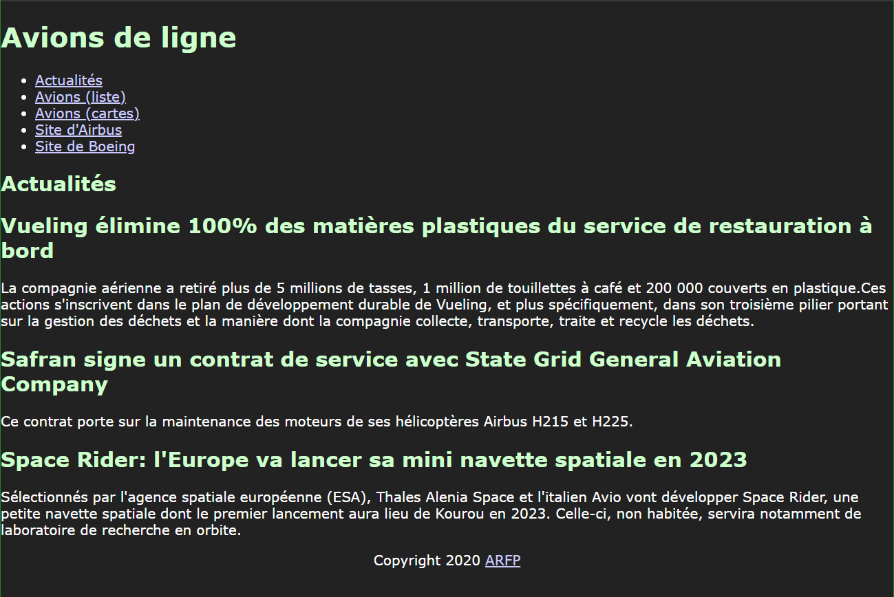
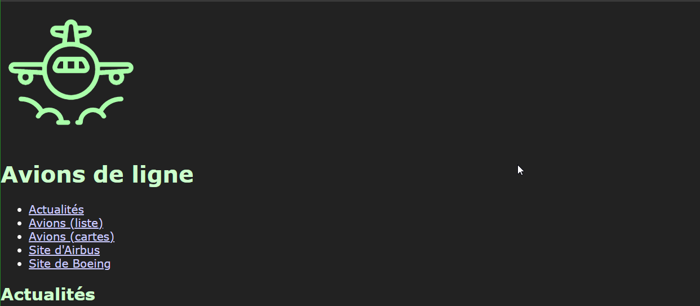
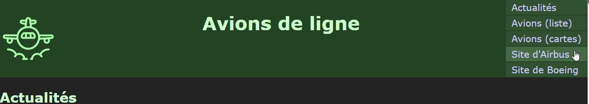

# Apprentissage des technologies "frontend"

Félicitations vous avez créé votre 1er document HTML, vous allez pouvoir passer a la suite, la mise en page !

## Mise en forme d'un document HTML

HTML permet de définir la structure d'un document.
Le langage CSS est quant à lui utilisé pour mettre en forme le contenu (positionner le contenu, ajouter des couleurs etc....) d'une page HTML.

Avant de démarrer vous pouvez vous documenter sur CSS via les tutoriels disponibles sur MDN :

https://developer.mozilla.org/en-US/docs/Web/Tutorials#CSS_Tutorials 

## Lier une feuille de style

Dans le répertoire `assets/css/`, créez un fichier `main.css`.
Liez ensuite ce fichier à votre document HTML.

#### Pour vous aider : 

https://developer.mozilla.org/en-US/docs/Web/HTML/Element/link 

## Le langage CSS

Les Feuilles de Styles en Cascade (CSS) existent depuis les débuts du web.
CSS permet de définir des "règles" d'affichage à des éléments précis d'un document XML ou HTML.

Dans le fichier `assets/css/main.css`, créez les règles CSS afin que la page index.html respecte les conditions suivantes :

- La couleur de fond de la page est #222222 
- La couleur du texte est #FFFFFF 
- La couleur des titres est #CCFFCC
- La couleur des liens est #CCCCFF
- Le texte utilise la police de caractères "Verdana"
- Il ne doit y avoir aucune marge entre les bords de la fenêtre et le contenu
- Le contenu du footer est centré horizontalement

Le rendu de votre page doit alors être celui-ci :

#### Pour vous aider 

Effectuez les recherches suivantes sur le web: 
- [CSS selectors](https://www.google.fr/search?q=css+selectors)
- [CSS text color](https://www.google.fr/search?q=css+text+color)
- [CSS text font](https://www.google.fr/search?q=css+text-font)
- [CSS margin padding](https://www.google.fr/search?q=css+margin+padding)

## Ajouter le logo

Ajoutez l'image `assets/planes/planes_logo.svg` à votre document HTML. L'image doit être affichée avec une largeur fixe de 100px.

Déterminez où placer l'élément à partir de la capture suivante :

Pour vous aider, effectuez des recherches sur le web.

## Mettre en forme l'entête de page

Avant de poursuivre, prenez le temps de vous documenter sur: 
- [le modèle des "boites CSS"](https://www.pierre-giraud.com/html-css-apprendre-coder-cours/block-inline/).
- [Les techniques de mise en page CSS](https://developer.mozilla.org/fr/docs/Apprendre/CSS/CSS_layout/Introduction)

Ajoutez les règles CSS suivantes à l'entête de page :

- display: flex
- couleur de fond: #224422

Observez le résultat.

Ajoutez ensuite les règles CSS nécessaires pour obtenir le résultat suivant :

Pour vous aider: [Guide Flexbox](https://css-tricks.com/snippets/css/a-guide-to-flexbox/)

## Mettre en page la totalité du document

Avec ces bases, vous devriez pouvoir terminer la mise en page de ce document HTML.

Proposez une mise en page pour les actualités en respectant le style défini jusqu'ici.

### Suite...

Lorsque vous avez terminé, validez avec votre formateur et attendez la suite qui sera disponible sur ce dépôt lorsque le groupe aura suffisamment avancé sur cette 1ère partie :) Vous aborderez alors les tableaux, l'affichage en grille (grillades) et les transitions CSS.