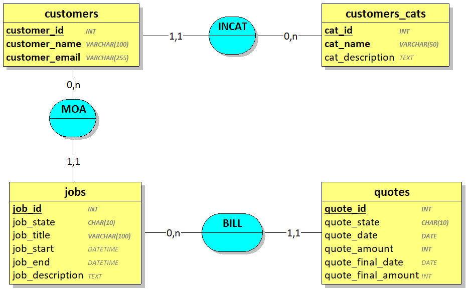
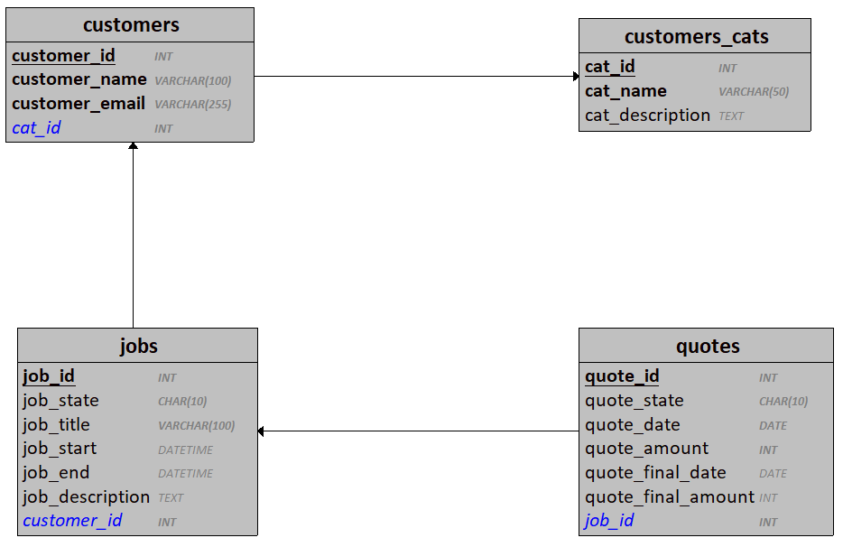
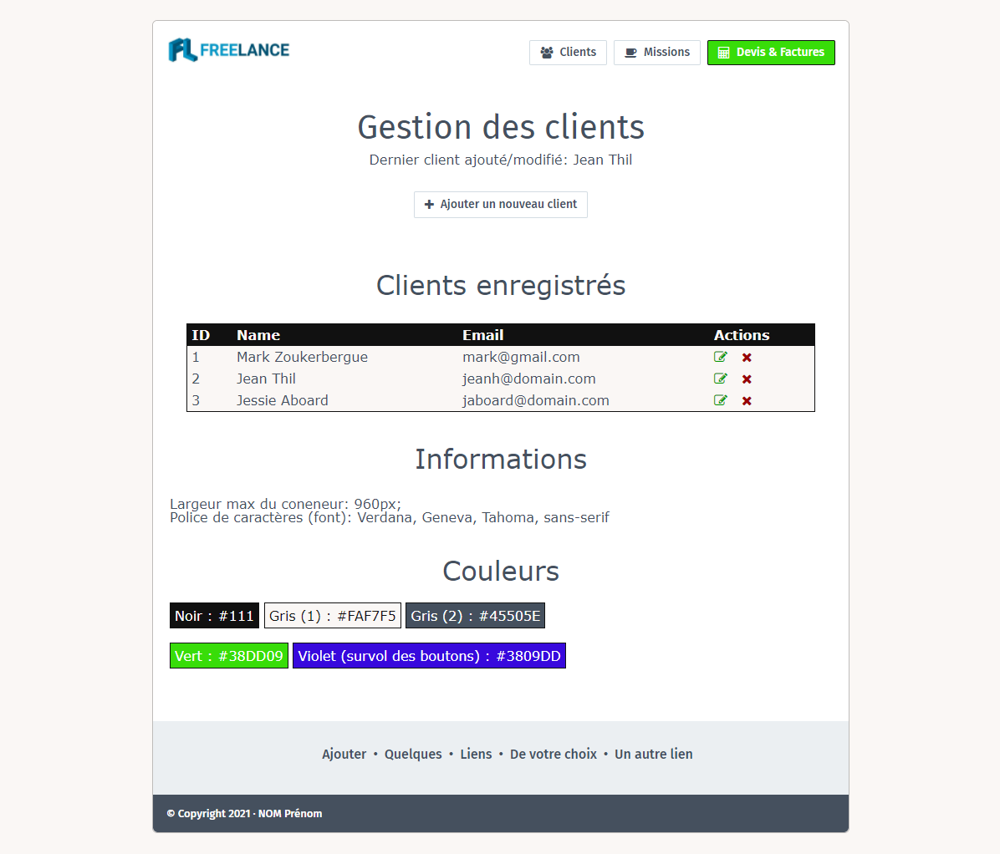

# CDA_2005

## Travaux pratiques : Projet Freelancer

Depuis peu, vous vous êtes lancé en tant que développeur indépendant, vous faites désormais partie de la grande famille des "développeurs Freelance".

En tant que Freelance, vous devez gérer votre portefeuille clients et planifier les diverses missions que vous acceptez.

Pour chaque mission que vous acceptez : 
1. vous enregistrez les informations du client
2. vous enregistrez les informations de la mission
3. vous définissez un tarif forfaitaire pour la mission
4. un devis est créé
5. Si le devis est refusé :
    - le devis peut-être modifié pour une 2nde proposition
    - la mission est clôturée (mais pas supprimée)
5. Si le devis est accepté, il est transformé en facture

Après de longues recherches, vous décidez finalement de créer votre propre application de gestion ce qui vous permettra d'y inclure toutes les fonctionnalités dont vous aurez besoin.

Afin de pouvoir accéder à votre logiciel à distance, votre choix s'est porté sur une application Web et vous décidez de la développer avec C# et ASP.NET MVC.

### Fonctionnalités :

- Gérer le portefeuille clients
    - Ajouter, éditer et supprimer des clients
    - Gérer les catégories de clients (particulier, entreprise, association, secteur public...)
- Gérer les missions
    - Créer/modifier/supprimer une mission
- Gérer les devis et la facturation
    - Afficher un devis ou une facture lié(e) à une mission (avec infos mission + client)
    - Afficher une facture globale d'un client (toutes les missions associées au client y sont inscrites)

### Base de données

[Modèle SQL](TP_Freelancer.sql)

#### MCD

#### MLD

## Maquette HTML

Les différentes vues HTML5 de la future application sont construites à partir de l'exemple suivant qui représente la vue de la liste des clients enregistrés.

Vous devez penser aux futures formulaires, comment les voyez-vous ? Proposez votre propre style ;)

Réfléchissez également aux éléments que vous souhaiterez afficher sur la future page d'accueil de votre application et comment les mettre en forme.

Le logo est accessible [ici](TP_Freelancer_Logo.jpg). 

> Pour l'affichage des icônes, une bibliothèque CSS : font-awesome est utilisée. Recherchez la version 4.7 (obligatoirement) sur le site officiel et consultez la documentation pour y intégrer les icônes de votre choix (en plus de celles présentes sur la maquette).

## Compétences mises en œuvre

- HTML
- CSS
- Javascript
- C#
- ASP.NET MVC
- Microsoft Entity Framework
    - Code First ou Database First 